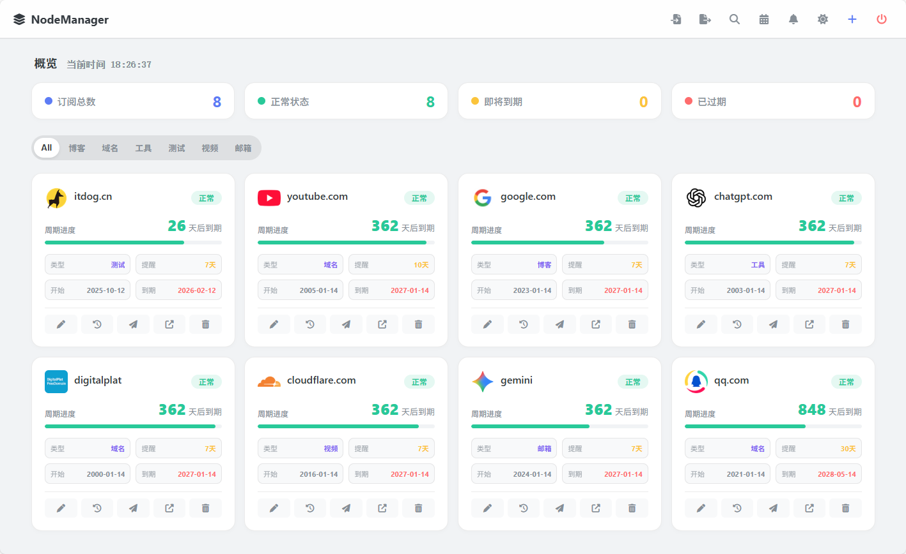

# NodeManager - 个人订阅管理助手

**NodeManager** 是一个轻量级、自托管的订阅管理系统，基于 Node.js 和原生前端技术构建。它可以帮助你集中管理各类服务（如 Netflix、Spotify、服务器、域名等）的续费周期，并通过 Telegram 机器人每日自动推送即将到期的提醒，防止服务中断。



## ✨ 主要功能

* **📊 数据看板**：直观展示订阅总数、状态分布（正常/即将到期/已过期）。
* **🎨 现代化 UI**：
    * 支持 **亮色 / 暗色 / 跟随系统** 主题切换。
    * 自动获取服务图标（Favicon），支持搜索过滤。
    * 动态进度条显示当前订阅周期的消耗情况。
* **⏰ 智能提醒系统**：
    * **每日检测**：系统每天 09:30 自动执行检查任务。
    * **自定义阈值**：每个订阅可单独设置提醒时间（例如：域名提前 30 天提醒，VPS 提前 7 天提醒）。
    * **Telegram 推送**：支持通过 HTTP 代理发送消息，国内网络环境也能稳定推送。
* **📅 日历视图**：提供月视图日历，直观查看每日的开始或到期项目，支持农历显示。
* **💾 轻量化存储**：使用本地 JSON 文件存储数据，无需安装 MySQL 或 MongoDB，备份迁移极其简单。

## 🌐 在线演示 (Demo)

你可以通过以下地址快速体验 NodeManager 的功能：

* **演示地址**：[https://nodenanager.zeabur.app/](https://nodenanager.zeabur.app/)
* **演示用户名**：`admin`
* **演示密码**：`admin`

> **提示**：演示环境仅供功能展示，请勿上传真实敏感的订阅信息。

## 🛠️ 技术栈

* **后端**：Node.js, Express
* **前端**：HTML5, CSS3, Vanilla JS (无大型框架依赖)
* **工具**：`node-cron` (定时任务), `axios` (请求), `jsonwebtoken` (JWT鉴权)

## 🚀 快速开始

### 1. 环境要求

* Node.js v16+
* npm 或 yarn

### 2. 安装

```bash
# 1. 克隆项目
git clone https://github.com/llodys/NodeManager.git
cd NodeManager

# 2. 安装依赖
npm install
```

### 3. 配置环境变量

在项目根目录下创建一个 `.env` 文件，复制以下内容并修改为你自己的配置：

```ini
# 服务运行端口
PORT=3000

# 登录管理员账号密码
ADMIN_USER=admin
ADMIN_PASS=admin

# JWT 签名密钥 (请修改为随机字符串以保证安全)
JWT_SECRET=change_this_to_a_random_secret_string

# --- Telegram 通知配置 ---
# 你的 Bot Token (找 @BotFather 获取)
TELEGRAM_BOT_TOKEN=123456789:ABCdefGHIjklMNOpqrsTUVwxyz
# 你的 Chat ID (也就是你的用户ID)
TELEGRAM_ADMIN_ID=12345678

# (可选) HTTP 代理地址
# 如果你的服务器无法直接连接 Telegram API，请配置此项
# 例如本地 Clash 端口通常是 7890
HTTP_PROXY=http://127.0.0.1:7890
```

### 4. 运行

**开发模式 (支持热重载):**

```bash
npm run dev
```

**生产模式:**

```bash
npm start
```

启动成功后，浏览器访问：`http://localhost:3000`

## 📂 目录结构

```text
├── public/              # 前端静态资源
│   ├── css/             # 样式文件
│   ├── js/              # 前端逻辑 (app.js)
│   ├── index.html       # 仪表盘主页
│   └── login.html       # 登录页
├── routes/              # API 路由
│   ├── authRoutes.js    # 登录认证接口
│   └── subRoutes.js     # 订阅管理接口
├── services/            # 后端服务
│   ├── cronJob.js       # 定时任务逻辑 (每日检查订阅状态)
│   └── telegramService.js # TG 消息发送逻辑 (含代理支持)
├── utils/               # 工具函数
│   └── db.js            # JSON 数据库读写封装
├── data/                # 数据存储目录
│   └── db.json          # 所有订阅数据保存在这里
├── app.js               # 后端入口文件
└── package.json
```

## ⚙️ 通知逻辑说明

1. **触发时间**：默认配置在 `app.js` 中，每天上午 09:30 触发。
2. **判断逻辑**：
    * 系统会遍历所有订阅。
    * 计算 `(到期日期 - 今天)` 的剩余天数。
    * 如果 `剩余天数 >= 0` 且 `剩余天数 <= 你设置的提醒天数`。
    * 发送 Telegram 通知。
3. **频率**：只要在提醒范围内，**每天**都会发送一次通知，直到你完成续费（修改到期时间）。

## 📝 备份与恢复

所有数据均存储在 `data/db.json` 中。

* **备份**：直接复制该文件到安全的地方。
* **恢复**：重装系统或迁移服务器时，只需将备份的 `db.json` 覆盖回 `data/` 目录即可。

## 📄 License

MIT License
